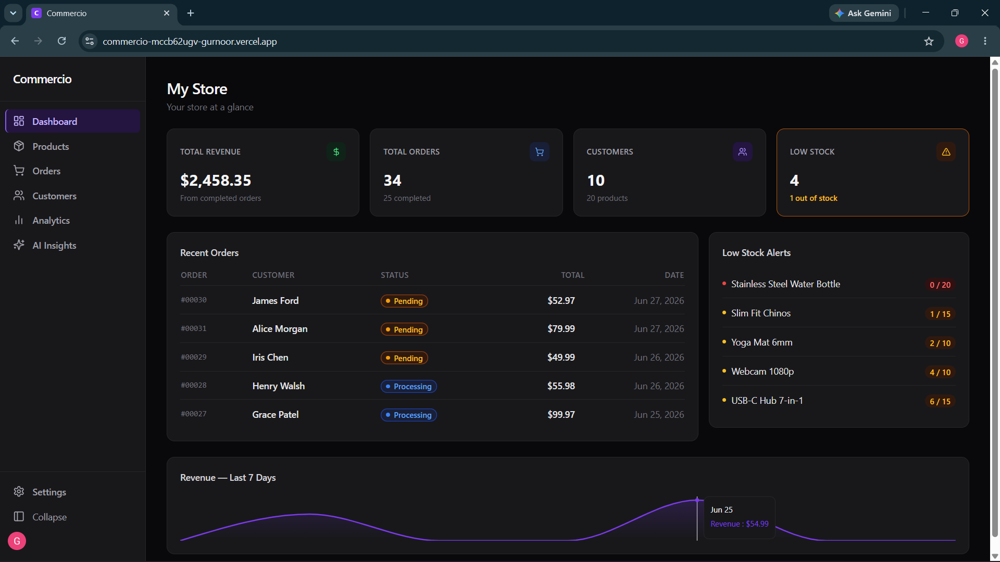
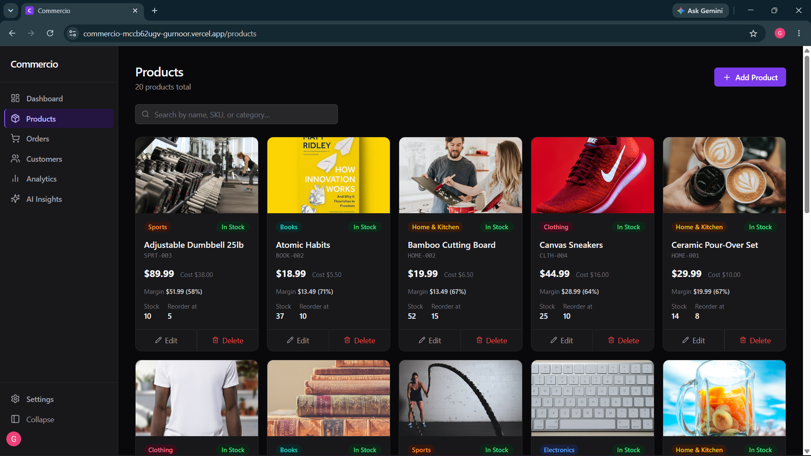
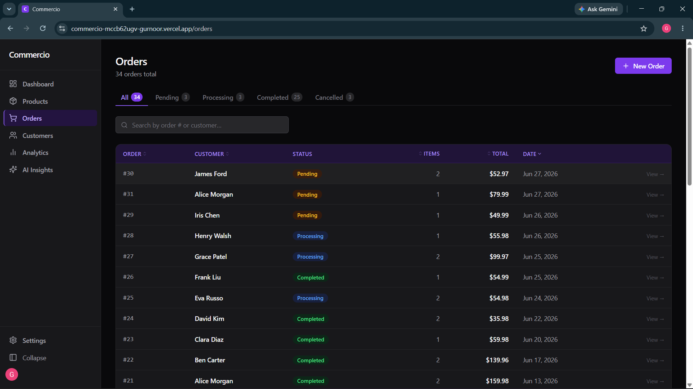
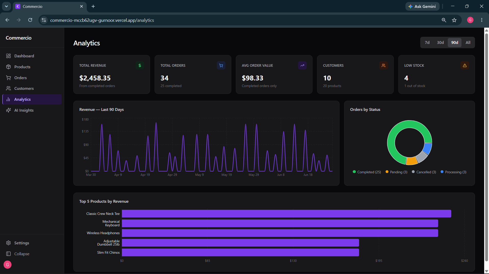
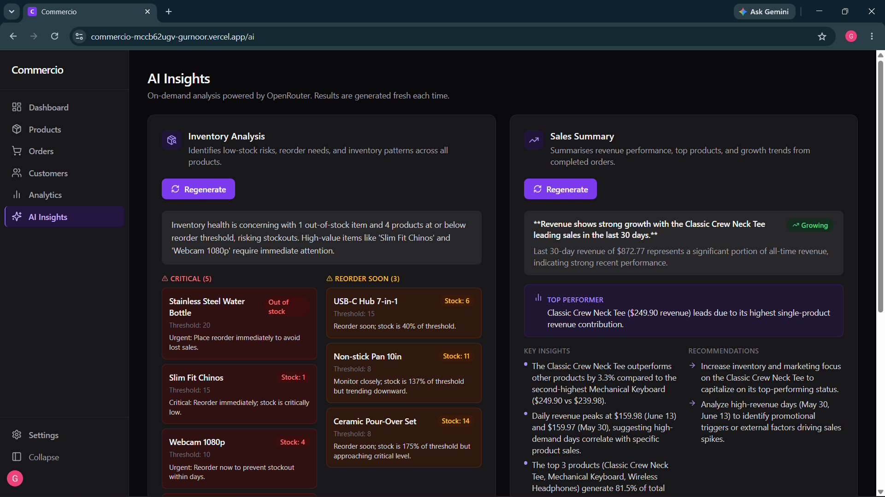

# Commercio

A **merchant operating system** — a unified back-office dashboard for products, inventory, customers, orders, and analytics, with LLM-powered inventory analysis and sales summarization.

**[Live Demo →](https://commercio-7tc55cin1-gurnoor.vercel.app)**

---

## Features

- **Products & Inventory** — full CRUD with SKU tracking, cost/price/margin fields, reorder thresholds, and oversell prevention
- **Orders** — 4-state lifecycle (`PENDING → PROCESSING → COMPLETED / CANCELLED`) with automatic inventory deduction and restock on cancellation
- **Customers** — CRM-lite with computed spend and order history
- **Analytics** — revenue KPIs, profit/margin, revenue-over-time chart, top products, low-stock table
- **AI Insights** — on-demand inventory analysis and sales summarization via Mistral, with Pydantic-validated structured outputs

## Tech stack

| Layer | Technology |
|-------|------------|
| Frontend | React 18 + TypeScript, Vite, Tailwind CSS, shadcn/ui, Recharts, React Router v6, React Query |
| Backend | FastAPI, SQLAlchemy ORM, Alembic, Pydantic v2 |
| Database | PostgreSQL (Neon) |
| Auth | Clerk (JWT verified on every API request) |
| LLM | Mistral API |
| Deployment | Render (backend) + Vercel (frontend) |

## Screenshots

> Add screenshots here after deploying — replace the paths below.

| Dashboard | Products |
|-----------|----------|
|  |  |

| Orders | Analytics |
|--------|-----------|
|  |  |

| AI Insights |
|-------------|
|  |

## Local development

### Prerequisites

- Python 3.11+
- Node.js 20+
- PostgreSQL (local or a free [Neon](https://neon.tech) database)

### Backend

```bash
cd backend
python -m venv .venv
.venv\Scripts\Activate.ps1        # Windows
# source .venv/bin/activate        # macOS/Linux
pip install -r requirements.txt
cp .env.example .env               # fill in DATABASE_URL and other keys
alembic upgrade head               # run migrations
python -m app.seed                 # seed demo data (optional)
uvicorn app.main:app --reload
```

API + Swagger docs: http://localhost:8000/docs

### Frontend

```bash
cd frontend
npm install
cp .env.example .env               # set VITE_API_BASE_URL=http://localhost:8000
npm run dev
```

App: http://localhost:5173

## Environment variables

### `backend/.env`

| Variable | Purpose |
|----------|---------|
| `DATABASE_URL` | PostgreSQL connection string |
| `CLERK_JWKS_URL` | Clerk JWKS endpoint for JWT verification |
| `CLERK_ISSUER` | Expected token issuer |
| `CLERK_AUDIENCE` | Expected audience claim (optional) |
| `AUTH_DISABLED` | `true` to skip auth in local dev |
| `MISTRAL_API_KEY` | Mistral API key |
| `MISTRAL_MODEL` | Model name (default: `mistral-small-latest`) |
| `CORS_ORIGINS` | Comma-separated allowed frontend origins |

### `frontend/.env`

| Variable | Purpose |
|----------|---------|
| `VITE_API_BASE_URL` | Backend API base URL |
| `VITE_CLERK_PUBLISHABLE_KEY` | Clerk publishable key |

## Deployment

| Service | What runs there |
|---------|----------------|
| [Render](https://render.com) | FastAPI backend (free tier) |
| [Vercel](https://vercel.com) | React frontend (free tier) |
| [Neon](https://neon.tech) | PostgreSQL database (free tier, no expiry) |

The `render.yaml` at the repo root is a Render Blueprint — connect your repo in Render and it configures the backend service automatically.
